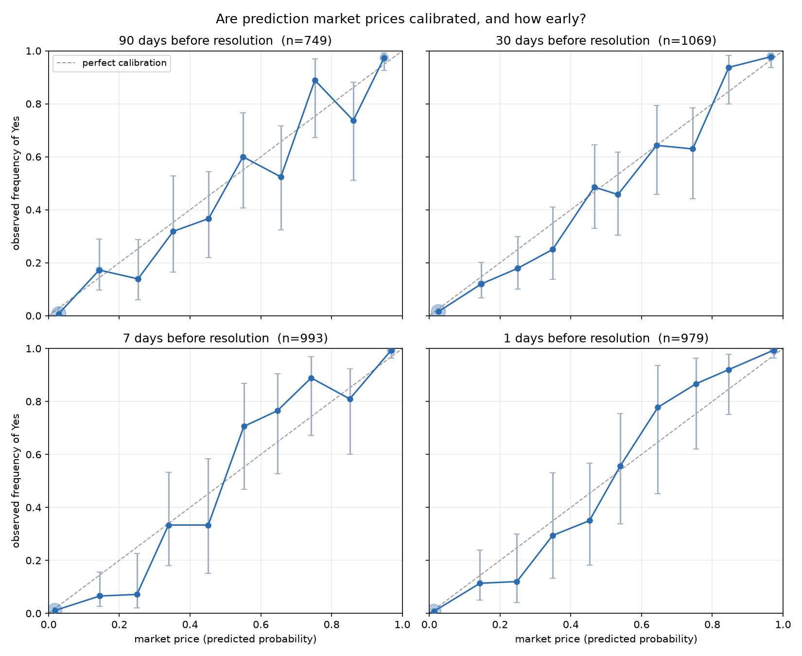
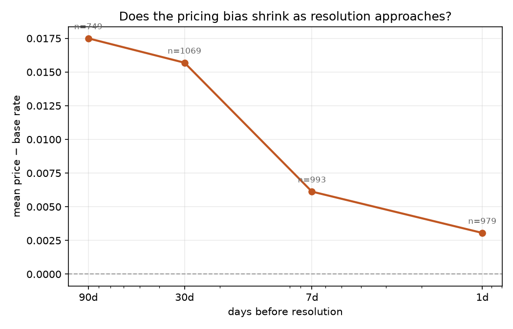

# market-calibration

**When a prediction market says 70%, does it happen 70% of the time - and how early does it know?**

This project pulls every resolved market it can from Polymarket, reconstructs the
price at four points before each market resolved, and checks those prices against
what actually happened.

**Dataset:** 1,295 resolved markets, 188,283 daily price points, April 2023 to
September 2026. All acquired from the public Polymarket API - no pre-packaged
dataset.

---

## Findings

### Markets are broadly calibrated, and they know early



Predicted probability tracks observed frequency closely at every horizon. The
Brier skill score - how much better the price is than simply forecasting the
base rate - is already 0.67 three months before resolution:

| horizon | n | Brier | baseline | skill |
|---|---|---|---|---|
| 90 days | 749 | 0.0644 | 0.1970 | **0.673** |
| 30 days | 1,069 | 0.0645 | 0.1879 | **0.657** |
| 7 days | 993 | 0.0372 | 0.1807 | **0.794** |
| 1 day | 979 | 0.0329 | 0.1781 | **0.815** |

Skill is reported alongside calibration deliberately. A forecast that predicts
the base rate for everything is *perfectly calibrated and useless*, so
calibration alone cannot tell you whether a market is informative. The rise from
0.67 to 0.82 says most of the information is present 90 days out, and the
remaining three months refine rather than transform it.

### Longshots are systematically overpriced

The 20-30% bucket sits below the diagonal in all four horizons, and again in all
four after deduplication - eight tables, two independent samples, never once
above the line:

| horizon | predicted | observed | n |
|---|---|---|---|
| 90 days | 0.253 | 0.139 | 36 |
| 30 days | 0.250 | 0.179 | 56 |
| 7 days | 0.250 | 0.071 | 28 |
| 1 day | 0.248 | 0.120 | 25 |

Individually these buckets have wide confidence intervals. The evidence is the
consistency across all eight, not any single cell. This is the classic
favorite-longshot bias: unlikely outcomes trade above their true probability.

### The bias shrinks as resolution approaches



Mean price exceeds the base rate at every horizon, and the gap narrows
monotonically: +0.017 at 90 days, +0.015 at 30, +0.006 at 7, +0.003 at 1.

---

## Caveats

**Markets are clustered by event.** 1,295 markets span only 601 distinct events -
a single UK election produced separate Labour, Conservative and Liberal Democrat
markets on the same underlying question. These are not independent observations.
Every figure can be regenerated with `--dedupe-events`, which keeps the
highest-volume market per event. Doing so cuts the sample from 1,161 markets to
538 and moves 90-day skill from 0.673 to 0.627 - the finding survives, but the
effective sample is roughly half the headline number.

**The tails dominate.** At 90 days, 407 of 749 observations fall in the bottom
decile and 113 in the top. Middle buckets hold 18-36 markets each, which is why
every rate here carries a Wilson score interval rather than a bare point
estimate.

**Daily resolution.** Prices are sampled daily, so the price "90 days before
resolution" is the nearest available point, on average 8 hours from the target.
That gap is stored per row (`horizons.gap_hours`) rather than rounded away.

---

## Pipeline

```
src/fetch.py     Polymarket API  ->  data/raw/*.json
src/load.py      raw JSON        ->  SQLite (3 tables) + Parquet
src/analyze.py   SQLite          ->  figures and tables
```

### Schema

| table | rows | contents |
|---|---|---|
| `markets` | 1,295 | question, dates, volume, resolved outcome, event id |
| `prices` | 188,283 | the full daily price arc per market |
| `horizons` | 3,790 | price at 90/30/7/1 days before resolution |

`horizons` is materialised rather than computed on the fly because it is the
table every analysis touches, and because the nearest-point search is the one
genuinely lossy step - storing it makes the loss inspectable.

### Resumability

`fetch.py` writes one file per unit of work and checks for that file before
making a request. A run that dies at market 900 of 1,301 resumes at 900 on the
next invocation rather than starting over. Markets that return no history are
written with `n_points: 0` rather than skipped, so they are not retried forever
and "no history" stays visible as a finding.

The load is idempotent: every write is `INSERT OR REPLACE` keyed on the primary
key, so re-running produces the same database rather than duplicate rows.

### Tests

```
pytest -v     # 30 tests
```

Covering the parsing layer, where the real mess lives: JSON-encoded fields that
should be lists, markets that never settled cleanly, short markets with no price
anywhere near a 90-day horizon.

---

## Data acquisition notes

Polymarket's API is public but thinly documented. Three constraints found by
testing rather than from the docs:

- **`fidelity` is effectively mandatory.** `prices-history` returns an *empty
  list* rather than an error when it is omitted, which initially looked like the
  data being unavailable. `fidelity` is bucket width in minutes; 1440 gives one
  point per day. This cost several hours to find - `scripts/night_0_check.py`
  is the script that isolated it by hitting one market eleven different ways.
- **History starts April 2023.** Sampling by quarter, 2023 Q1 returned 0/6
  markets with history and Q2 returned 6/6. The break is clean and matches
  Polymarket's move from an AMM to a CLOB order book.
  (`scripts/find_cutoff.py`)
- **Gamma caps `offset` at 2000.** Deeper pagination requires the
  `/markets/keyset` endpoint. The current dataset works within that ceiling.

Of 2,100 markets in the feed, 1,301 survived a $20k volume floor and a 30-day
minimum duration - the latter excludes auto-generated sports micro-markets like
"Exact Score: Team A 2 - 0 Team B", which resolve in 90 minutes and whose prices
track a live scoreboard rather than a forecast. 1,300 of those returned price
history; 1,295 settled cleanly enough to score.

---

## Running it

```bash
pip install -r requirements.txt

python src/fetch.py                    # ~50 min, ~6 MB
python src/load.py --parquet
python src/analyze.py
python src/analyze.py --dedupe-events
pytest -v
```

Diagnostics used to reverse-engineer the API are kept in `scripts/`.
